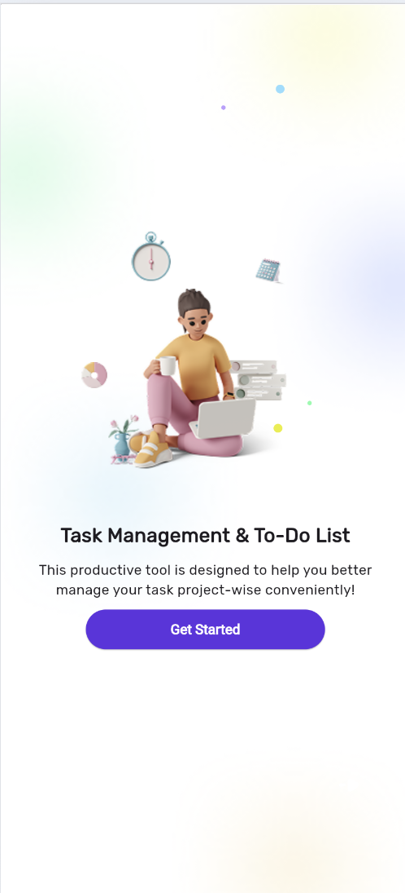
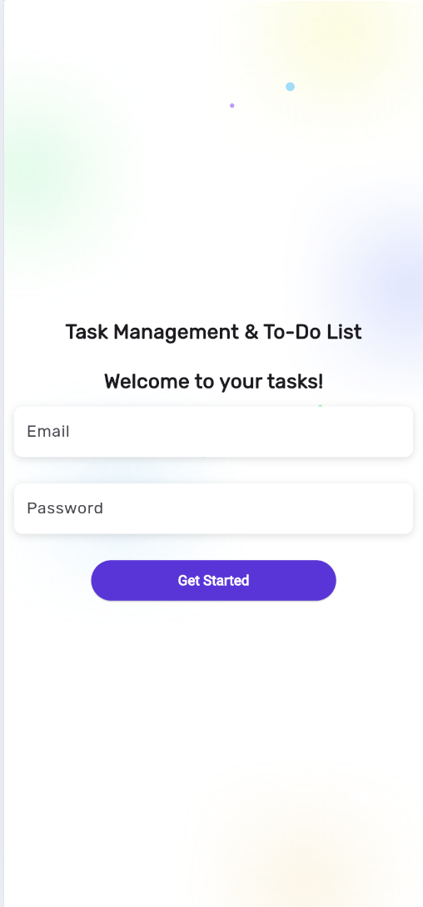
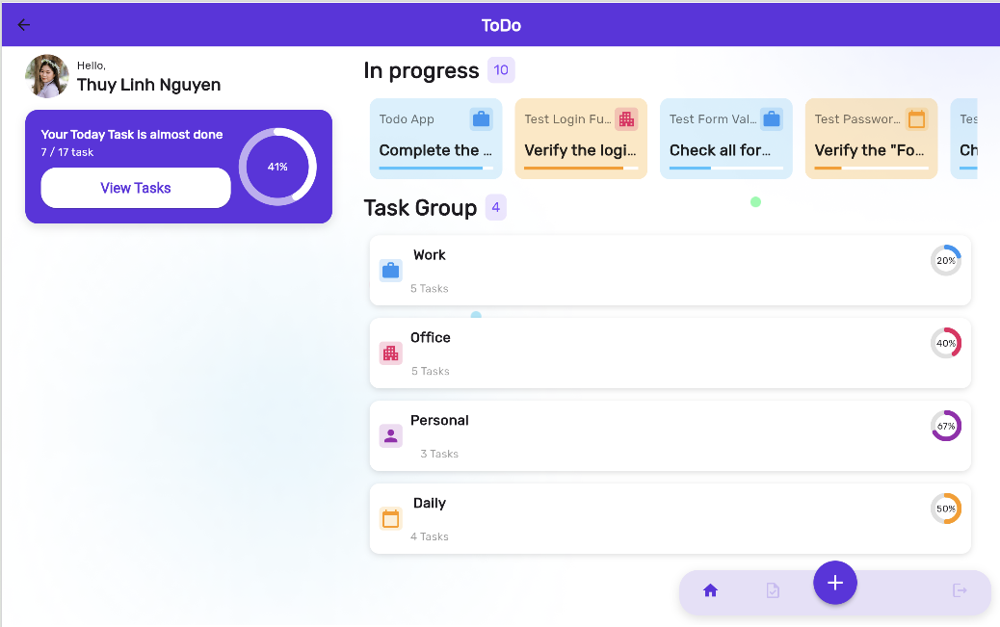
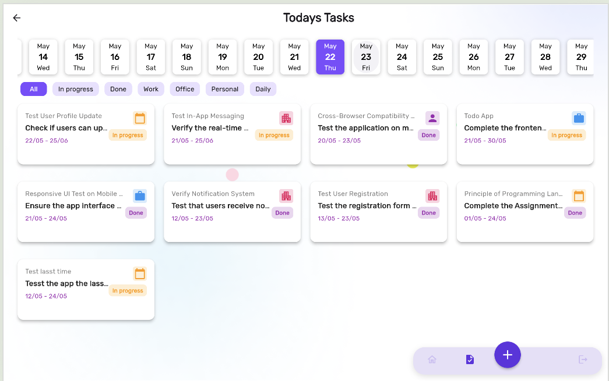
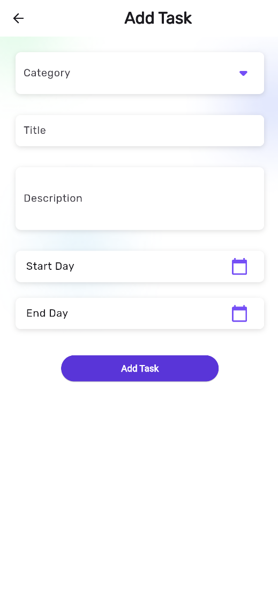
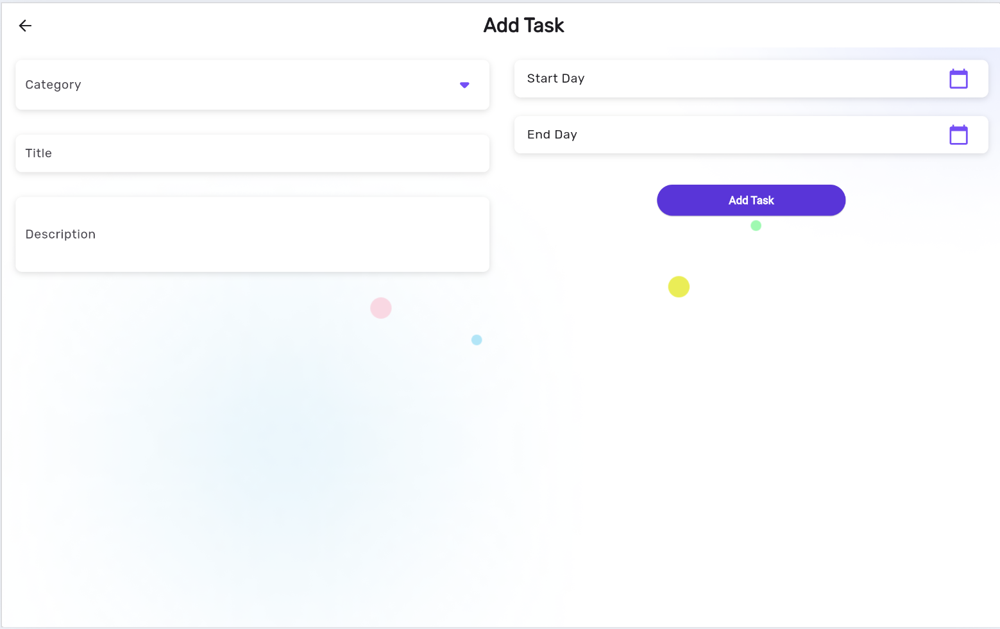

# 📝 To Do App

A cross-platform To Do List application built with **Flutter**. Users can add, view, and manage daily tasks with a responsive and intuitive interface inspired by a professional UI design from Figma. The app uses **Firebase** for real-time cloud data storage and synchronization.

## Author

Nguyễn Hà Thùy Linh 

Email: linhnguyen.8023@gmail.com

## Demo

- Link: [ToDoApp](https://todoapp-a6b36.web.app)
- Link: [Figma](https://www.figma.com/design/XZksqBHe7KYNZh4HswVRe6/Task-management---to-do-list-app--Community-?node-id=1-87&p=f&t=2JnMc1nw2aPjWCct-0)

## Features

- ✅ Add, update, and delete tasks
- 📆 Date-based task filtering
- 🗂️ Category filters (e.g., Work, Personal, Office)
- 🎨 Beautiful UI based on Figma design
- 🔥 Realtime data with Firebase Firestore
- 🌐 Responsive design (Mobile + Web)

## Screenshots

- Start page:

- Login page:

- Main page:

- View task:

- Add task:

## Technologies Used

- **Flutter** — UI framework
- **Firebase Firestore** — Cloud NoSQL database
- **Provider** — State management
- **Figma** — UI/UX Design
- **Dart** — Programming Language
